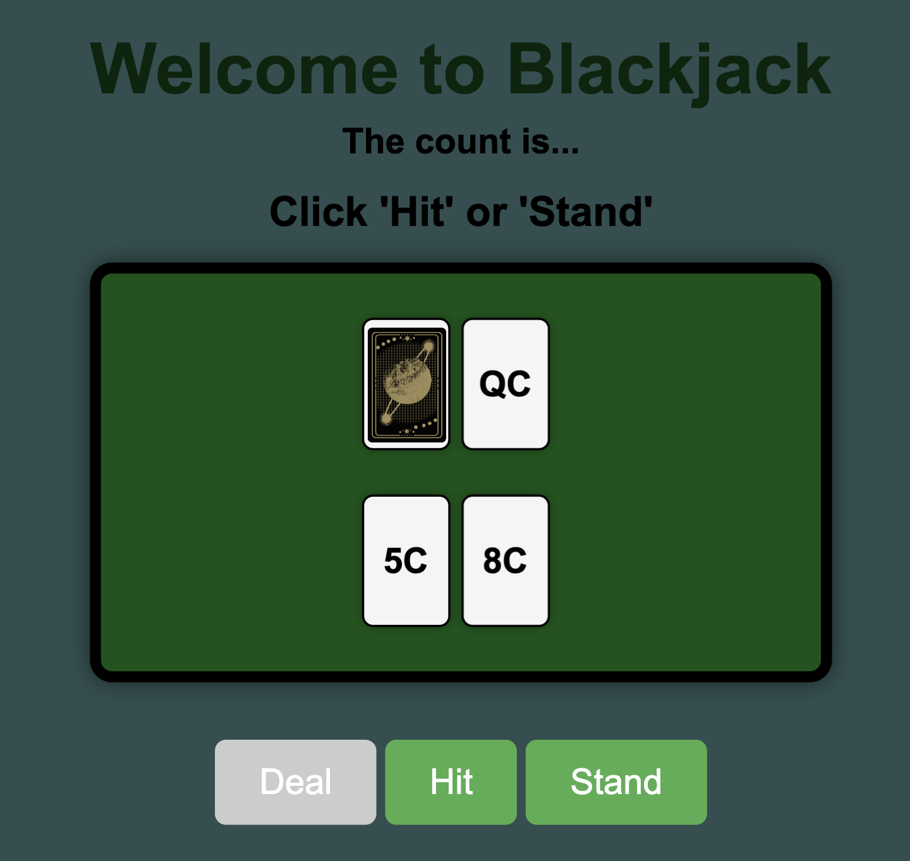

# blackjack-for-card-counters

Welcome to Blackjack! 

Players face an AI dealer in a classic game of Blackjack, coded according to the real sequence of play at a casino (cards are dealt, player hits until they choose to stand or, regrettably, bust.

I created the app using vanilla JS, HTML5, and CSS3, with an emphasis on factoring my code usng OOP and an MVP framework.

I opted for a clean, simple visual style with mobile-first breakpoints, as seen below:

Game begins:

You win!

Counter displayed:

I'm particularly proud of my implementation of the "count" feature, which not only keeps a running count through an entire deck but also waits to update until the conclusion of a hand (the same way real card-counters are supposed to keep their tally).

My stretch goals include (but are not limited to):

    --add an optional "hand total" feature
    --add card-face visuals
    --add multiple players and styles of play (hit vs stand on soft 17, etc)
    --add a blackjack feature complete with insurance, 3/2 payout, etc.

I'm very excited to extend these skills towards developing an "endless runner" game using only vanilla JS and HTML canvas.
